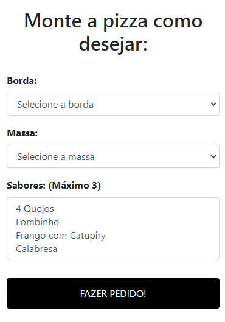
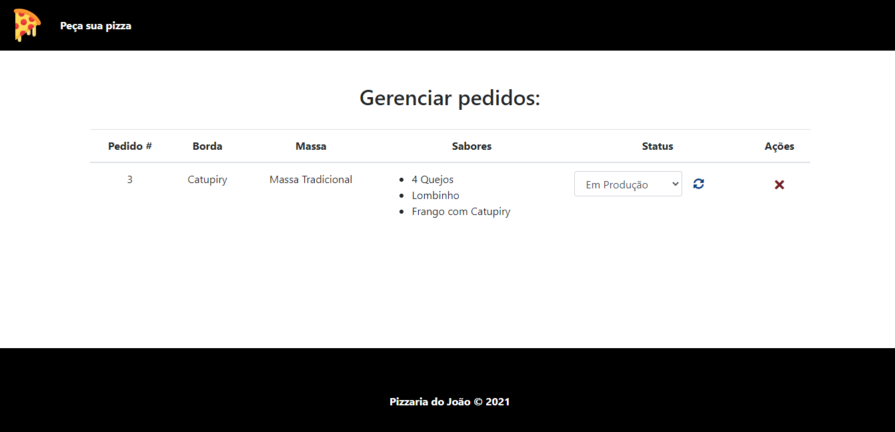

# Pizzaria
Projeto de um software para pedidos de pizzaria.

## Minha aplicação:

## Tecnologias utilizadas:

<ul>
  <li>MYSQL</li>
  <li>PHP</li>
  <li>BOOTSTRAP</li>
</ul>

## Sobre a aplicação:

Esse sistema é um site para pedidos de pizza, nele o cliente pode fazer um pedido construindo sua pizza como desejar, podendo assim selecionar
o recheio da borda, tipo de massa e até três sabores diferentes. Existe também uma página do site onde um usuário pode fazer o gerenciamente desses pedidos, podendo visualizar,
editar os status do pedido e cancelar um pedido. O sitema não possui funcionalidades de entrega da pizza, assim o cliente terá que vim buscar a pizza.

 

Além disso, o sistema faz uso de ténicas de responsividade para uma melhor experiência no celular.

## Ficaria feliz com Feedbacks:

Email: raphaeldesousalm@gmail.com  
Linkdin: https://www.linkedin.com/in/raphaellima98/

